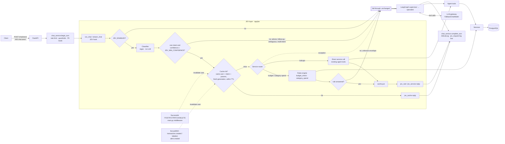
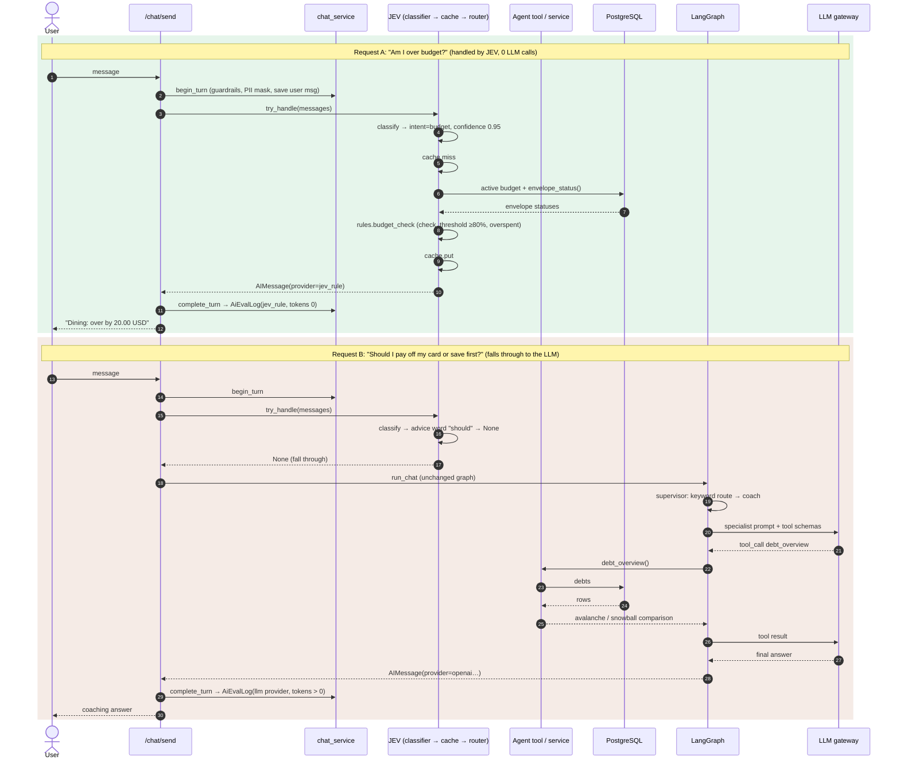

# FinanceBuddy AI Architecture

The chat assistant answers through two layers. **JEV** is a deterministic layer that runs first. It
handles lookups, calculations, rule checks and repeat questions without an LLM. Anything it can't
answer with high confidence falls through, unchanged, to the existing **LangGraph + LLM** path.

## 1. Before JEV

Every chat turn reached the LLM. The supervisor sometimes made an extra LLM call to choose a route.
The chosen specialist then made at least one more call to pick tools and another to write the answer.

```mermaid
flowchart LR
    C[Client<br/>web / desktop / mobile] -->|POST /chat/send<br/>WS chat.send| API[FastAPI<br/>api/chat.py · api/ws.py]
    API --> CS[chat_service.begin_turn<br/>rate limit · guardrails · PII mask]
    CS --> G[LangGraph run_chat / stream_chat<br/>ai/graph.py]
    G --> SUP{supervisor<br/>keywords → LLM router}
    SUP --> SPEC[Specialist ReAct agent<br/>coach · budget · fraud · goals · tax · assistant]
    SPEC <-->|tool calls| LLM[LLM gateway<br/>FallbackChatModel<br/>OpenAI → Anthropic → Gemini → Ollama]
    SPEC --> T[Agent tools<br/>ai/tools.py]
    T --> SVC[Services<br/>budget_engine · forecaster · goals_debt · tax_engine · subscriptions]
    SVC --> DB[(PostgreSQL)]
    T --> DB
    SPEC --> DONE[chat_service.complete_turn<br/>persist reply · AiEvalLog]
```



## 2. After JEV



**Decision points**
1. **`JEV_ENABLED`** is the kill switch. When it's off, every turn goes to the LLM exactly as before.
2. **The classifier** gives up (returns no intent) when a question:
   - contains an advice or action word (*should, why, how can I, help, plan, create, change…*),
   - starts like a follow-up (*what about…, and…*),
   - is longer than 160 characters,
   - matches zero intents or more than one,
   - or asks about a period the tools can't express exactly (*last month*).
3. **Confidence** below `JEV_MIN_CONFIDENCE` (0.8 by default) falls through.
4. **The rules engine** returns nothing for an unknown or ambiguous envelope or category, and the
   request falls through.
5. **Any exception** inside JEV falls through. UI blocks emitted before the failure are rolled back
   so they don't leak into the LLM turn.

## 3. Request sequences



## Components

| Component | Responsibility | File path |
|---|---|---|
| JEV hook | Single entry check before the graph runs. On the WebSocket it streams the JEV answer as one delta followed by the final message | `server/app/ai/graph.py` (`run_chat`, `stream_chat`) |
| JEV facade | Runs classify → cache → router → reply. Handles the confidence gate, safe fall-through, and per-request counters and logs | `server/app/jev/__init__.py` |
| Intent classifier | Deterministic regex and keyword intents with parameters (days, category, tax year, quarter). Never calls an LLM | `server/app/jev/classifier.py` |
| Rules engine | Pure functions: over-budget and near-limit checks (reusing `budget_engine.check_threshold`) and one-category spend | `server/app/jev/rules.py` |
| Service router | Maps each intent to the existing agent tool or service with `tool.ainvoke`, so business logic and UI blocks are reused | `server/app/jev/router.py` |
| Cache | TTL cache of JEV answers only, keyed by user, intent and params, with a per-user generation counter for invalidation | `server/app/jev/cache.py` |
| Invalidation: writes | A successful mutating HTTP request from a user bumps that user's cache generation | `server/app/main.py` (`jev_invalidate_on_write`) |
| Invalidation: events | `bus.publish` (transaction created or labeled, alerts) bumps that user's cache generation | `server/app/services/events.py` |
| Metrics | Writes `AiEvalLog.provider_used` (`jev_cache`, `jev_rule`, `jev_service` or the LLM provider), with 0 tokens on JEV turns, plus a `jev_request` log line | `server/app/services/chat_service.py` |
| Stats API | Reports per-user turns by handler and the percentage of LLM calls avoided | `GET /api/v1/ai/jev/stats` in `server/app/api/ai.py` |
| Config | `JEV_ENABLED` (default `true`), `JEV_MIN_CONFIDENCE` (0.8), `JEV_CACHE_TTL_SECONDS` (300) | `server/app/core/config.py` |
| LLM path (unchanged) | Supervisor, specialists, prompts, tools and provider failover | `server/app/ai/graph.py`, `server/app/ai/llm_router.py`, `server/app/ai/tools.py` |

## Intents handled by JEV

| Intent | Example | Handler | Reused code |
|---|---|---|---|
| balance | "What is my account balance?" | service | `list_accounts` |
| spend | "How much did I spend in the last 14 days?" | service | `spending_summary` |
| spend + category | "How much did I spend on groceries?" | rule | `spending_summary` → `rules.category_spend` |
| budget | "Am I over budget?", "How much is left in dining?" | rule | `envelope_status` + `check_threshold` → `rules.budget_check` |
| goals | "Show my goals" | service | `goal_overview` |
| debts | "Avalanche vs snowball" | service | `debt_overview` → `compare_strategies` |
| alerts | "Any alerts?" | service | `recent_alerts` |
| subscriptions | "List my subscriptions" | service | `subscriptions_detected` |
| tax_summary / deductions / gst | "My tax estimate for 2026", "GST Q2 2026" | service | `tax_summary`, `deduction_overview`, `gst_report` |
| forecast | "Forecast my cash flow" | service | `forecast_cashflow` |

## Measuring LLM-call reduction

- **Persisted, per user:** `GET /api/v1/ai/jev/stats` returns `{total, by_handler, llm_tokens_estimated, llm_calls_avoided_pct}`.
- **SQL, all users:**
  ```sql
  SELECT CASE WHEN provider_used LIKE 'jev_%' THEN provider_used ELSE 'llm' END AS handled_by,
         count(*), sum(tokens_in + tokens_out) AS llm_tokens, avg(latency_ms)
  FROM ai_eval_logs WHERE provider_used <> 'guardrails' GROUP BY 1;
  ```
- **Logs:** each chat turn emits `jev_request handled_by=… latency_ms=… llm_tokens=… jev_total=… llm_total=… llm_calls_avoided_pct=…`.
  The totals are running counts for that process.

**Known limits**
- LLM token counts are the existing word-count estimate. The app doesn't capture real provider usage.
- The cache lives in one process. With more than one API worker, each worker keeps its own copy until
  the TTL runs out. Moving it to Redis is the upgrade path.
